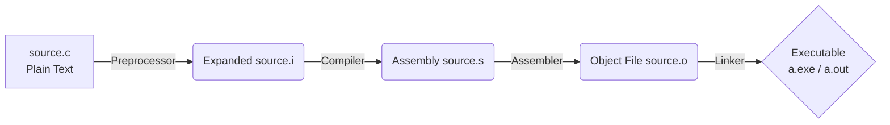

# 01 - Architecture and Compilation ⚙️

Before writing code, we need to understand the machine we are talking to.

## The CPU and RAM (Beginner Explanation)
Imagine the **CPU** as a super-fast but forgetful chef. 
Imagine **RAM (Memory)** as an infinite whiteboard. 
The chef (CPU) can only cook one instruction at a time, and keeps reading the next instruction from the whiteboard (RAM).

## The C Compilation Pipeline
C is a **compiled** language. We write text, and a toolchain turns it into pure binary (1s and 0s) that the CPU understands natively.



### The 4 Stages:
1. **Preprocessor:** Scans the file for `#` commands (like `#include`). It literally copy-pastes the contents of `stdio.h` into your file.
2. **Compiler:** Translates your C code into **Assembly Language** (low-level CPU instructions like `MOV`, `ADD`).
3. **Assembler:** Translates Assembly into **Machine Code** (binary).
4. **Linker:** Takes your machine code and links it with pre-compiled libraries (like the code that actually prints to the screen in the OS) to create the final executable.

## How to Actually Compile and Run (The `gcc` Command)
Once you have written your code in a file (e.g., `main.c`), you need to tell the compiler to translate it into an executable. We use **GCC** (GNU Compiler Collection).

### Step 1: Compile the Code
Open your terminal in the same folder as your file and type:
```bash
gcc main.c -o myprogram.exe
```
* `gcc`: Calls the compiler.
* `main.c`: The file you want to compile.
* `-o myprogram.exe`: Tells it to "**o**utput" an executable named `myprogram.exe`.

### Step 2: Run the Executable
Now that the computer has a binary file it understands, you can run it:
```bash
.\myprogram.exe
```
*(The `.\` tells the terminal "look in the current folder" for `myprogram.exe`)*

> [!tip] Deep Dive: Compilation Flags
> When you run `gcc main.c`, it does all 4 steps at once. You can stop it at any step!
> - `gcc -E main.c` -> Stops after Preprocessing.
> - `gcc -S main.c` -> Stops after Compilation (outputs `.s` assembly file).
> - `gcc -c main.c` -> Stops after Assembling (outputs `.o` object file).

➡️ Next: [[02_Syntax_and_Structure]]
