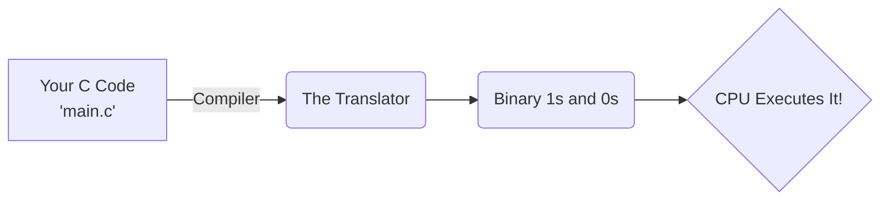

# 01 - How Computers Read Code ⚙️

Before we code, let's understand what's happening under the hood.

## The CPU and RAM
Imagine the **CPU (Processor)** as a super-fast, but very forgetful chef.
Imagine **RAM (Memory)** as an infinite whiteboard.
The chef (CPU) can only cook one instruction at a time. It constantly looks at the whiteboard (RAM) to read the next step.

## The Translator (The Compiler)
Computers only understand **1s and 0s (Binary)**. They do not understand English.
C is a bridge. We write instructions in English-like words (like `printf`), and a special tool called a **Compiler** translates it into 1s and 0s for the CPU.



## How to Compile and Run Your Code
Once you write your code and save it as `main.c`, you use the Terminal to translate and run it.

### Step 1: Translate it
```bash
gcc main.c -o myprogram.exe
```
This tells the `gcc` compiler to translate `main.c` and **o**utput a runnable file named `myprogram.exe`.

### Step 2: Run it
```bash
.\myprogram.exe
```
This tells the computer to run the program you just created!

➡️ Next: [02 Syntax and Structure](02_Syntax_and_Structure.md)
⬅️ Back: [README](README.md)
