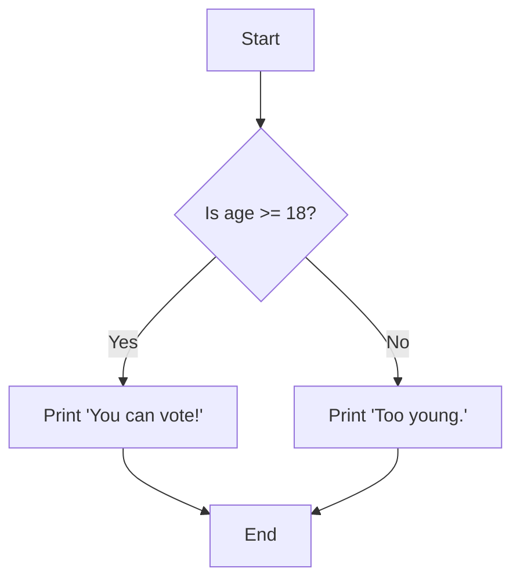
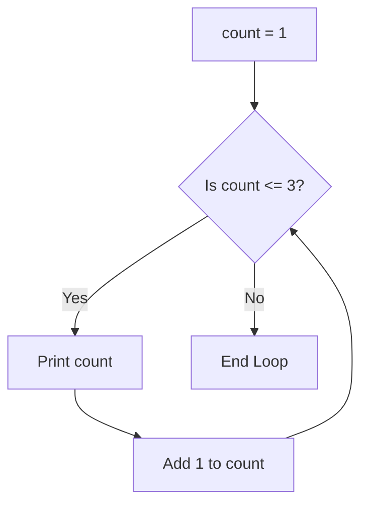

# 05 - Logic and Loops 🛤️🔄

Code usually runs top-to-bottom. But sometimes we want to skip lines, or repeat them.

## The `If / Else` Statement (Making Choices)
This allows your code to make decisions based on conditions.



```c
int age = 20;

if (age >= 18) {
    printf("You can vote!\n");
} else {
    printf("Too young.\n");
}
```

## Loops (Doing things over and over)
If you want to print "Hello" 100 times, you don't write `printf` 100 times. You use a loop.

### The `while` Loop
Runs **as long as** a condition is true.



```c
int count = 1;
while (count <= 3) {
    printf("%d\n", count);
    count++; // If you forget this, the loop runs forever!
}
```

### The `for` Loop
The `for` loop is just a compact version of a `while` loop. It puts the setup, condition, and increase all on one line. It's the most common loop in programming!

```c
//   (setup; condition; increase)
for (int i = 1; i <= 3; i++) {
    printf("%d\n", i);
}
```

➡️ Next: [06 Functions and Stack](06_Functions_and_Stack.md)
⬅️ Back: [04 Operators and Math](04_Operators_and_Math.md)
