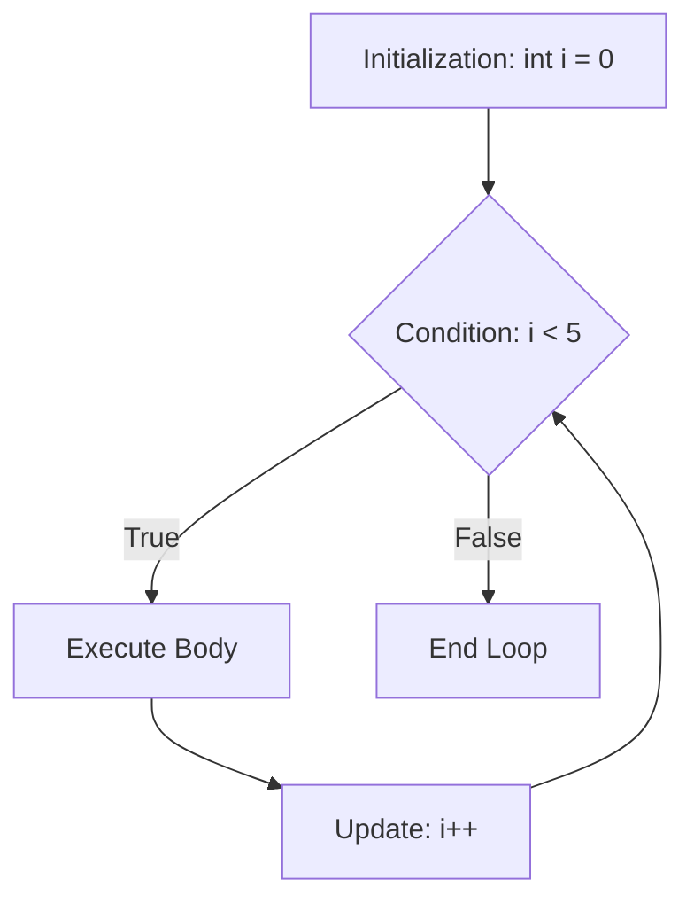

# 05 - Control Flow & Loops 🛤️🔄

How we alter the linear execution of code.

## The `if-else` Statement
Standard conditional logic. 
* **Nerd Note:** In C, there is no Boolean data type (unless you include `<stdbool.h>`). Instead, **`0` is False**, and **any non-zero number (1, -5, 99) is True**. 

```c
if (5) { // This will ALWAYS run, because 5 is not 0.
    printf("True!");
}
```

## The `switch` Statement
Used for checking a single variable against multiple exact values. Faster than long `if-else` chains because compilers can optimize it into a "jump table".

```c
int choice = 2;
switch(choice) {
    case 1:
        printf("One");
        break; // Crucial! Without break, it "falls through" to case 2.
    case 2:
        printf("Two");
        break;
    default:
        printf("Other");
}
```

## Loops

### `while` vs `do-while`
* `while (condition) { ... }` checks the condition BEFORE running. It might run 0 times.
* `do { ... } while (condition);` runs the code FIRST, then checks. It is guaranteed to run at least 1 time.

### The `for` loop
Perfect for iteration. Contains 3 parts: `for( initialization ; condition ; update )`



> [!tip] Nerd Note: The Ternary Operator
> A compact `if-else` used for assigning values. `condition ? true_value : false_value;`
> Example: `int max = (a > b) ? a : b;`

➡️ Next: [[06_Functions_and_Stack]]
