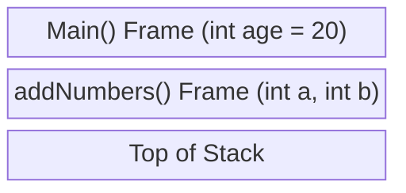

# 06 - Functions and The Call Stack 🥞

Functions break code into reusable modules. To really understand this, we must look at **The Call Stack**.

## What is the Call Stack?
When a program runs, memory is divided into sections. One crucial section is the **Stack**. 
When you call a function, a new "Frame" is pushed onto the Stack. This frame holds the function's local variables. When the function finishes (returns), that frame is popped off and destroyed.



## Pass by Value
Because of the Stack, C uses **Pass by Value**. When you pass a variable into a function, C makes a **copy** of it in the new Stack Frame.

```c
void tryToChange(int x) {
    x = 99; // Only changes the COPY inside tryToChange's stack frame!
}

int main() {
    int myNum = 5;
    tryToChange(myNum);
    printf("%d", myNum); // Still prints 5!
    return 0;
}
```
> [!info] Exercise / Tip
> Think of it this way: "If I give you a photocopy of a recipe, and you cross out 'sugar' and write 'salt', my original recipe at home is completely unchanged. C makes photocopies of variables."

How do we let a function modify the original? We need to give it the memory address! (Enter Pointers...).

➡️ Next: [07 Pointers Demystified](07_Pointers_Demystified.md)
