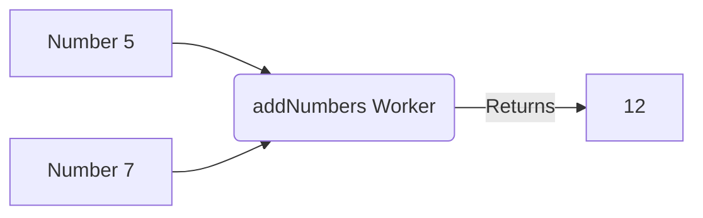

# 06 - Functions 🥞

If you put all your code inside `main()`, it gets very messy very fast. **Functions** are a way to break your code into reusable mini-programs.

## What is a Function?
Think of a function as a specialized worker in a factory. You give the worker some materials (Inputs), the worker does a specific job, and hands you back a finished product (Output).



## Writing a Function

```c
#include <stdio.h>

// 1. Defining the worker
// 'int' means this worker gives back an integer. 
// 'int a, int b' are the materials the worker needs.
int addNumbers(int a, int b) {
    int total = a + b;
    return total; // Hands the answer back!
}

int main() {
    // 2. Calling the worker
    int answer = addNumbers(5, 7); 
    printf("The answer is: %d\n", answer);
    
    return 0;
}
```

> [!tip] Deep Dive: The Photocopy Rule
> When you pass a variable to a function, C makes a **photocopy** of it. If the function modifies the copy, your original variable back in `main()` is completely safe and unchanged!

➡️ Next: [07 Pointers Demystified](07_Pointers_Demystified.md)
⬅️ Back: [05 Control Flow and Loops](05_Control_Flow_and_Loops.md)
