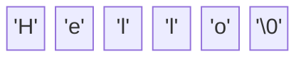

# 08 - Arrays and Strings 📚

An array is a continuous block of memory mailboxes holding the same type of data.

## Array / Pointer Duality
The deepest secret of C is that **Arrays are basically just constant pointers.**
When you create `int scores[5]`, the variable name `scores` is actually just a pointer to the address of the 0th element.

`scores == &scores[0]`

```c
int scores[3] = {10, 20, 30};
printf("%d\n", scores[0]);   // Standard way: Prints 10
printf("%d\n", *scores);     // Pointer way: Prints 10 (dereferencing the start)
printf("%d\n", *(scores+1)); // Pointer arithmetic: Prints 20 (moves forward 1 int, then dereferences)
```

## Strings in C
Unlike Python, C does not have a `String` data type. A string is just an **Array of Characters**.

But how does C know when the string ends? It uses a **Null Terminator** (`'\0'`, which has an integer value of `0`).



```c
// These two are essentially the same:
char name1[] = {'H', 'e', 'l', 'l', 'o', '\0'};
char name2[] = "Hello"; // The compiler adds \0 automatically!

// Using string.h
#include <string.h>
int len = strlen(name2); // Scans memory until it hits '\0', returns 5.
```

> [!tip] Deep Dive: String Literals
> If you do `char *str = "Hello";`, this is stored in **Read-Only Memory**. If you try to do `str[0] = 'J';`, your program will crash (Segmentation Fault). Always use `char str[] = "Hello";` if you want a modifiable array on the Stack.

➡️ Next: [[09_Structs_and_Custom_Types]]
