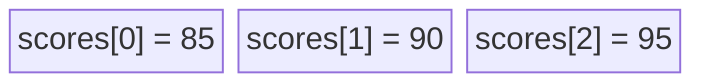
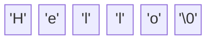

# 08 - Arrays and Strings 📚

Sometimes you need to store a *list* of things, like 5 test scores. Instead of making 5 separate variables (`score1`, `score2`, etc.), we use an **Array**.

## What is an Array?
An array is a single variable that holds a continuous row of mailboxes in memory.

**Crucial Rule:** Computers start counting at `0`, not `1`! To get the first item, you ask for item `#0`.



```c
int scores[3] = {85, 90, 95}; // Creates a row of 3 boxes

printf("First score: %d\n", scores[0]); // Prints 85
printf("Second score: %d\n", scores[1]); // Prints 90
```

## Text (Strings)
In C, there is no special variable type for text words. A "String" of text is literally just an **Array of Characters**.

But how does the computer know when the word stops? It uses a hidden secret symbol called the **Null Terminator** (`\0`).



```c
// The compiler automatically adds the hidden \0 at the end!
char greeting[] = "Hello"; 
printf("%s\n", greeting); // %s is the placeholder for strings
```

➡️ Next: [09 Structs and Custom Types](09_Structs_and_Custom_Types.md)
⬅️ Back: [07 Pointers Demystified](07_Pointers_Demystified.md)
